# terraform-aws-k8s-jenkins-pipeline
This stack will provide a full CI/CD infrastructure on AWS using Terraform and Kubernetes.  

I'll guide you through the steps below to spin up the entire infrastructure for this sample minimalistic production-ready environment.  

In the end you will have a entire infrastructure running on AWS with Kubernetes and also a complete pipeline providing a CI/CD infrastrucuture for your project.

---
###### *Navigate* | [*Top*](#terraform-aws-k8s-jenkins-pipeline) | [*1) Requisites and Configurations*](#1-requisites-and-Configurations-before-start) | [*2) Infrastructure Creation*](#2-infrastructure-creation) | [*3) Jenkins Access and Use*](#3-jenkins-access-and-use) | [*4) Jenkins Crecdentials*](#4-creating-credentials-on-jenkins) | [*5) The Project*](#5-the-project) | [*6) Pipeline*](#6-pipeline) | [*7) Infrastructure exclusion*](#7-infrastructure-exclusion) | [*Conclusion*](#conclusion) | 
---

## 1) Requisites and Configurations before start

Even its being an automated infrastructure project, you will need some tools and configurations before start.  
These are the versions of each requisite and configuration used during the development of this project.  
In some cases, I've noticed that using different versions of these tools some errors could happen.  
I'll encourage you to run the project even if you have a different version of any of them, but keep in mind that if you are facing some issue the reason could be these versions.  

`IMPORTANT:`  I decided use that versions based on its stability, its knowed issues for the most common stacks and also the community support.


### 1.1) Tools
- Terraform - `v0.11.13` - [MacOS](https://releases.hashicorp.com/terraform/0.11.13/https://releases.hashicorp.com/terraform/0.11.13/terraform_0.11.13_darwin_amd64.zip) / [Linux](https://releases.hashicorp.com/terraform/0.11.13/https://releases.hashicorp.com/terraform/0.11.13/terraform_0.11.13_linux_amd64.zip)
- Kops - `v1.11.1` - [MacOS](https://github.com/kubernetes/kops/releases/download/1.11.1/kops-darwin-amd64) / [Linux](https://github.com/kubernetes/kops/releases/download/1.11.1/kops-linux-amd64)
- Kubectl - `v1.11.10` - [MacOS](https://storage.googleapis.com/kubernetes-release/release/v1.11.10/bin/darwin/amd64/kubectl) / [Linux](https://storage.googleapis.com/kubernetes-release/release/v1.11.10/bin/linux/amd64/kubectl)
- Helm - `2.14.1`- [MacOS](https://get.helm.sh/helm-v2.14.1-darwin-amd64.tar.gz) / [Linux](https://get.helm.sh/helm-v2.14.1-linux-amd64.tar.gz)
- Python - `2.7.10` and `3.7.2`
- Python Libs - (Boto, Boto3 and BotoCore for Python 2.x and 3.x)
- aws-cli - `aws-cli/1.16.110 Python/3.7.2 Darwin/18.6.0 botocore/1.12.100`
- jq - `1.6` - Command-line JSON processor

### 1.2) Configuration
- Terraform: [terraform/virtuoso-configuration.tf](terraform/virtuoso-configuration.tf)
  - In this file you can configure a lot of items related to your project. I'd like to highlight some items that you definitely have to customize for your case:
    - `${locals.application}`
    - `${locals.route53_host_zone}`
    - `${locals.k8s_cluster_name}`
    - `${locals.jenkins_admin_password}`
- AWS
  - `aws-cli` with a configured profile: Following the best practices and to be compatible with this project, you should configure your AWS Command Line to use profiles.
    - After install the aws-cli, run in your console:
      - ```shell
            $ aws configure --profile <PROFILE_NAME>

            AWS Access Key ID [None]: <ACCESS_KEY_ID>
            AWS Secret Access Key [None]: <SECRET_KEY>
            Default region name [None]: <DEFAULT_REGION>
            Default output format [None]: <OUTPUT>```
      - I'm using `us-east-1` for this project as `DEFAULT_REGION` (check `${locals.vpc_azs}`)
  - To be able to work in a colaborative way, I'm saving the Terraform status in a `S3 bucket` and controlling concurrent tasks with a `DynamoDB table`. You can check and modify these configurations in the `${terraform.backend}` group at [terraform/virtuoso-configuration.tf](terraform/virtuoso-configuration.tf).
    - Anyway you will need to create these referenced resources manually:
      - Create a S3 Bucket (optionally you can enable the versioning on this buckets, like a git =)
        - BucketName: `guilhermevirtuoso-terraform-state-prod`
        - Region: `us-east-1`
      - Create a DynamoDB for lock management
        - TableName: `guilhermevirtuoso-terraform-lock-prod`
        - PrimaryKey: `LockID`
        - Region: `us-east-1`
  - Create a Route53 Zone (`guilhermevirtuoso.com` on this case) and configure the Name Servers on your register.
    - We need a valid FQDN register for Kops. 
    - On this project I'm using the AWS DNS service Route53. You can use any other service, but you will need to do some adjustments on the kubernetes DNS management system (External-DNS)
- Ensure that are able to run all the binaries. If not, try to put each one inside the `/usr/local/bin` folder and give the right permissions. (terraform, kops, kubectl and helm)
- Ensure that all `.sh` files in the root folder have permission for execution
  - `$ chmod +x *.sh`

Wow, that's it. Let's have fun!

---
###### *Navigate* | [*Top*](#terraform-aws-k8s-jenkins-pipeline) | [*1) Requisites and Configurations*](#1-requisites-and-Configurations-before-start) | [*2) Infrastructure Creation*](#2-infrastructure-creation) | [*3) Jenkins Access and Use*](#3-jenkins-access-and-use) | [*4) Jenkins Crecdentials*](#4-creating-credentials-on-jenkins) | [*5) The Project*](#5-the-project) | [*6) Pipeline*](#6-pipeline) | [*7) Infrastructure exclusion*](#7-infrastructure-exclusion) | [*Conclusion*](#conclusion) | 
---

## 2) Infrastructure creation

After make your customizations and create the resources mentioned on the `Requisites` topic, run each file following the order that I'll guide you.  

Running all scripts, the result will be like the image below where you can see the VPC, Subnets, NAT Gateways, AutoScaling Groups, Load Balancer, Route53, DynamoDB, S3, Kubernetes Master and Nodes and the Pipeline flow with Github, Jenkins and DockerHub.  

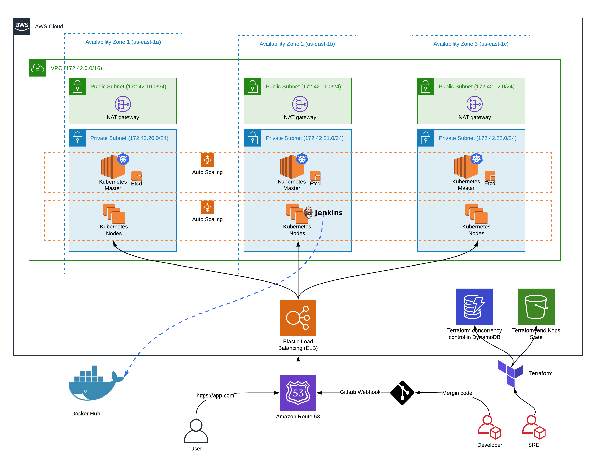

---

The files are separeted by prefix groups to be easy to create more scripts and to definy its priority.  


### 2.1) File [001.aws-infra.sh](001.aws-infra.sh)

```shell
$ AWS_PROFILE=<profile_name> ./001.aws-infra.sh
```

This shell script will access the Terraform config files and will provide a basic infrastructure to create the Kubernetes environment. After run this script you will have in your AWS account the follow resources:
- VPC
- Subnets Public and Private
- Internet Gateways
- NAT Gateways for provide internet acces to the Internal instances
- Route Tables
- Security group with inbound traffic to accept external access on K8s Ingress Load Balancer
- S3 Bucket for save Kops state
- Also you will have some outputs mapped for further use in the next steps

After you run this script, you should be able to se the Terraform output about each resource that was created:  

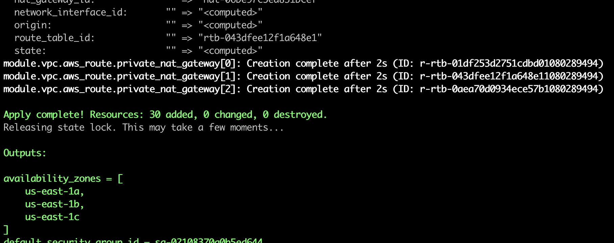

---

### 2.2) File [002.k8s-install.sh](002.k8s-install.sh)

```shell
$ AWS_PROFILE=<profile_name> ./002.k8s-install.sh
```

This shell script will access the Kubernetes folder and generate a cluster template based on the outputs of our last step.  
After that I will use this template together with [kops](https://github.com/kubernetes/kops), which is a tool specific for kubernetes operations turning your life much easier when you need to deal with that.

After run this script I will generate some resources for you:
- Route53 entries for cluster management
- IAM Roles for master and node instances
- Security groups
- Master and Node instances in a isolated way using private subnets
- Etcd EBS volumes
- An ELB for Kubernetes API
- AutoScaling groups for Master and Node in case of failure

In the last step I also will configure your `kubectl`, so you are ready to run commands in your cluster:  

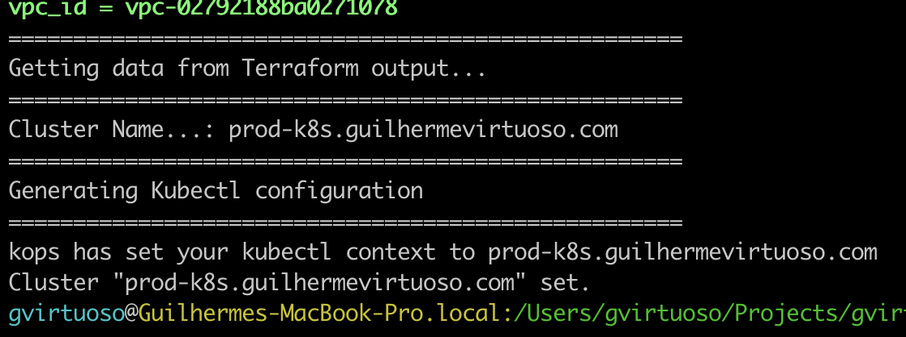

---

### 2.3) File [003.kops-validate-cluster.sh](003.kops-validate-cluster.sh)

```shell
$ AWS_PROFILE=<profile_name> ./003.kops-validate-cluster.sh
```

This step is very important to check if everything is ok.  
You should run the script and get a message confirming that your cluster is up and running.  
`Only continue to the other steps after pass this step.`  
While you cluster is being created this script could fail.  
Don't worry with that, wait a little bit and try again.  

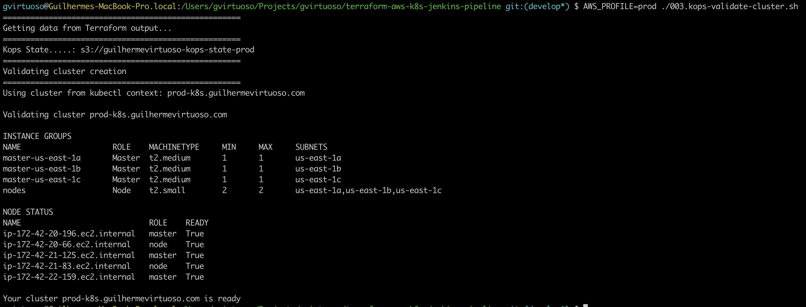

---

### 2.4) File [100.helm-config.sh](100.helm-config.sh)

```shell
$ AWS_PROFILE=<profile_name> ./100.helm-config.sh
```

Now that everything is already running properly we will initialize the [Helm](https://helm.sh/) in your cluster to help us in some package managements.  
All that you need to know right now about helm is that it is like [Maven](https://maven.apache.org/) for Java or [NPM](https://www.npmjs.com/) and [Yarn](https://yarnpkg.com/en/) for NodeJS.  
It's very easy install, uninstall, upgrade, even the most complex kubernetes application.
You can get more info about Helm in its [documentation](https://helm.sh/docs/).  

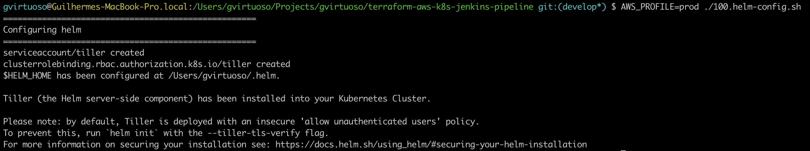

---

### 2.5) File [101.k8s-extras.sh](101.k8s-extras.sh)

```shell
$ AWS_PROFILE=<profile_name> ./101.k8s-extras.sh
```

Now we reach an important point of our infrastructure provisioning.  
This script will install some important peaces of your Kubernetes cluster:
- `External DNS Controller`
  - With that package we will manage the Route53 entries to point for our infrastructure
- `Cert-Manager`
  - Through this package we will be able to generate SSL certs for our workloads
- `Nginx-Ingress Controller`
  - This module is responsible for manage all our traffic pointing to the right node where our app is mapped acting as a Load Balancer as well.
- `Jenkins`
  - In this project I'm using Jenkins as our CI/CD server.
  - This helm chart was customized to install Jenkins almost ready for use needing only two configurations before start using it.
  - You can check the file [kubernetes/helm-values/jenkins.yaml](kubernetes/helm-values/jenkins.yaml) to take a look in all the plugins and scripts that we are running to customize the instance during its booting.

This script could take more time than the others, so be patient.  
In my case this script tooks 6 minutes in average to run.

---
###### *Navigate* | [*Top*](#terraform-aws-k8s-jenkins-pipeline) | [*1) Requisites and Configurations*](#1-requisites-and-Configurations-before-start) | [*2) Infrastructure Creation*](#2-infrastructure-creation) | [*3) Jenkins Access and Use*](#3-jenkins-access-and-use) | [*4) Jenkins Crecdentials*](#4-creating-credentials-on-jenkins) | [*5) The Project*](#5-the-project) | [*6) Pipeline*](#6-pipeline) | [*7) Infrastructure exclusion*](#7-infrastructure-exclusion) | [*Conclusion*](#conclusion) | 
---

## 3) Jenkins Access and Use

If everything works properly, now you will be able to access your CI/CD server.  
According to my configurations I'm able to access the server using the info below:
- [http://jenkins.prod-k8s.guilhermevirtuoso.com](http://jenkins.prod-k8s.guilhermevirtuoso.com)
- User: `admin`
- Password: `admin`

Initial screen:


SSL issued by [Cert-Manager](https://github.com/plotly/helm-charts/tree/master/stable/cert-manager) and [Let's Encrypt](https://letsencrypt.org/):
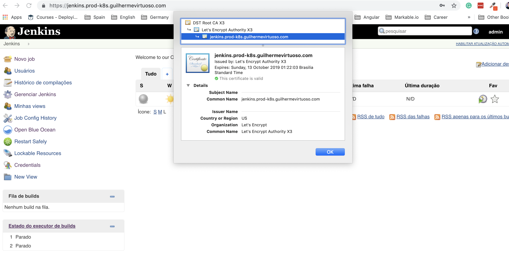
  
As mentioned before, you can configure in [terraform/virtuoso-configuration.tf](terraform/virtuoso-configuration.tf) the itens below for your scenario:  
- `${local.route53_host_zone}`
- `${local.jenkins_admin_user}`
- `${local.jenkins_admin_password}`

As you can see after your first login, you already have a Job (a job seeder) that will create other jobs in a automated way based in our project.  
Take a look in the `jenkins-dsl` folder. In this folder you can save your groovy scripts to create your jobs.

Before run the initial job to create the other ones, you need to create two credentials on Jenkins:
- `dockerhub` - To push the images for your account;
- `github` - Use this credential to not being stuck in the API limit for anonymous access;

The next step will guide you on it.

---
###### *Navigate* | [*Top*](#terraform-aws-k8s-jenkins-pipeline) | [*1) Requisites and Configurations*](#1-requisites-and-Configurations-before-start) | [*2) Infrastructure Creation*](#2-infrastructure-creation) | [*3) Jenkins Access and Use*](#3-jenkins-access-and-use) | [*4) Jenkins Crecdentials*](#4-creating-credentials-on-jenkins) | [*5) The Project*](#5-the-project) | [*6) Pipeline*](#6-pipeline) | [*7) Infrastructure exclusion*](#7-infrastructure-exclusion) | [*Conclusion*](#conclusion) | 
---

## 4) Creating credentials on Jenkins

- 1) Click on `Credentials` on the left menu
- 2) On the main screen, click on the dropdown menu passing your mouse over the word `global` and choose `Add Credential`
  - 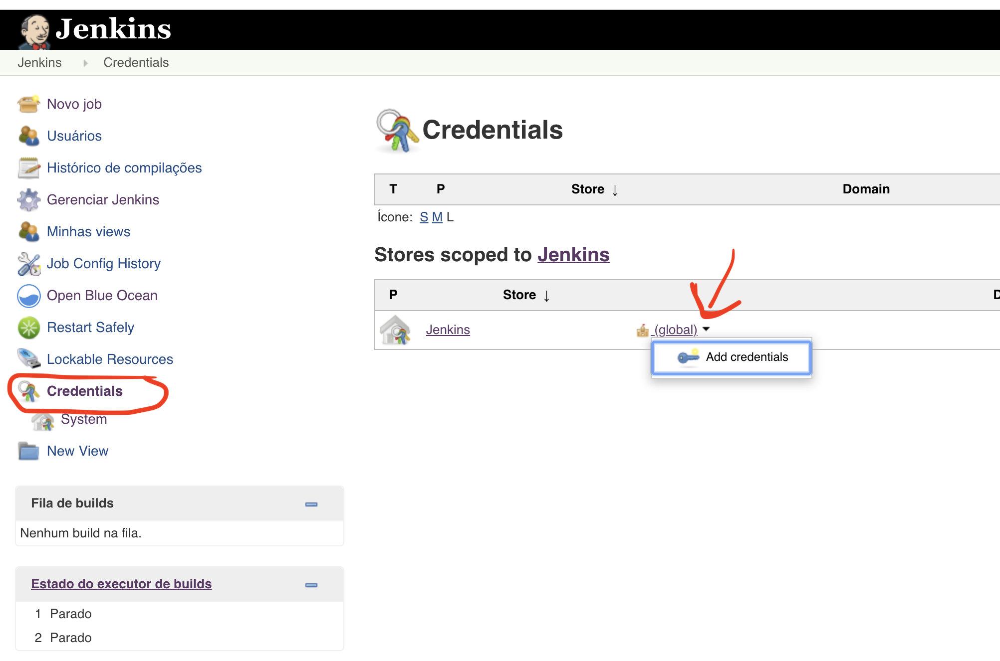
- 3) Fill the field with your credentials
  - 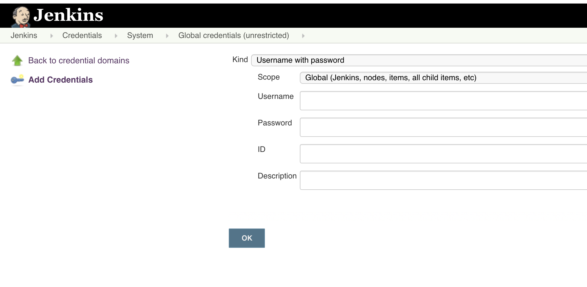

---

### 4.1) Credential for DockerHub
  - id: `dockerhub` - SHOULD BE THIS ID
  - user: Your Docker Hub user
  - password: Your Password
  - description: DockerHub credential

---

### 4.2) Credential for Github
- id: `github` - SHOULD BE THIS ID
- user: Your Github user
- token: Personal Github Token (You can create one here: [https://github.com/settings/tokens](https://github.com/settings/tokens))
- description: Github access token
- `NOTE:` We are using public repositories, but with anonymous access you have a limit of request, that is the reason why we suggest you to make these configurations.

---
###### *Navigate* | [*Top*](#terraform-aws-k8s-jenkins-pipeline) | [*1) Requisites and Configurations*](#1-requisites-and-Configurations-before-start) | [*2) Infrastructure Creation*](#2-infrastructure-creation) | [*3) Jenkins Access and Use*](#3-jenkins-access-and-use) | [*4) Jenkins Crecdentials*](#4-creating-credentials-on-jenkins) | [*5) The Project*](#5-the-project) | [*6) Pipeline*](#6-pipeline) | [*7) Infrastructure exclusion*](#7-infrastructure-exclusion) | [*Conclusion*](#conclusion) | 
---

## 5) The Project

I'm using a small project to demonstrate the pipeline.  
It can be found here: [https://github.com/gvirtuoso/docker-sample-nginx](https://github.com/gvirtuoso/docker-sample-nginx)  

After run the pipeline, this app will be available at [https://app.prod-k8s.guilhermevirtuoso.com/](https://app.prod-k8s.guilhermevirtuoso.com/)  

Here is the Kubernetes deployment descriptor:  [docker-sample-nginx.yaml](https://github.com/gvirtuoso/docker-sample-nginx/blob/master/docker-sample-nginx.yaml)  

All the pipeline will follow our Jenkins file descriptor: [Jenkinsfile](https://github.com/gvirtuoso/docker-sample-nginx/blob/master/Jenkinsfile)  

You also can check the DockerHub: [https://hub.docker.com/r/gvirtuoso/docker-sample-nginx](https://hub.docker.com/r/gvirtuoso/docker-sample-nginx)  

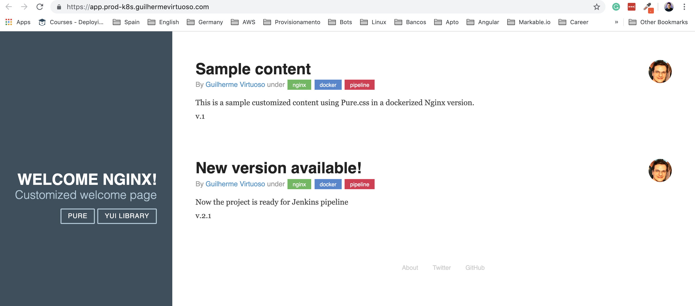

I strongly recommend enable the Github webhooks for your project.  
This Jenkins server are ready for it.  

Go to your project on Github and configure the your webhook trigger the Jenkins for all events on the URL:
- `https://jenkins.prod-k8s.guilhermevirtuoso.com/github-webhook/`

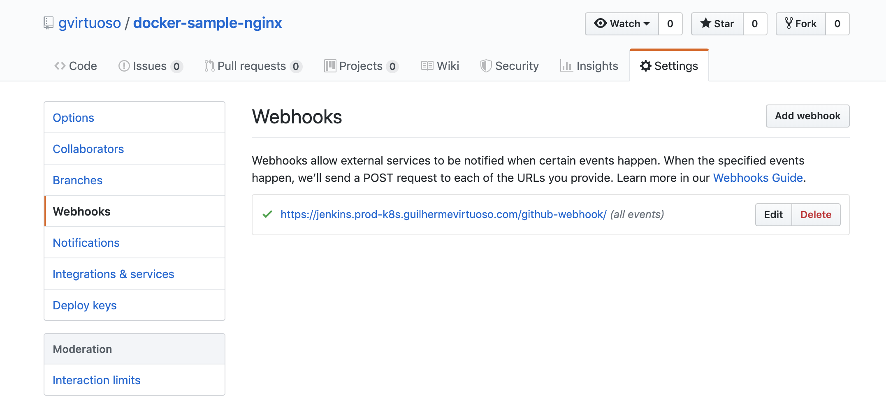

---
###### *Navigate* | [*Top*](#terraform-aws-k8s-jenkins-pipeline) | [*1) Requisites and Configurations*](#1-requisites-and-Configurations-before-start) | [*2) Infrastructure Creation*](#2-infrastructure-creation) | [*3) Jenkins Access and Use*](#3-jenkins-access-and-use) | [*4) Jenkins Crecdentials*](#4-creating-credentials-on-jenkins) | [*5) The Project*](#5-the-project) | [*6) Pipeline*](#6-pipeline) | [*7) Infrastructure exclusion*](#7-infrastructure-exclusion) | [*Conclusion*](#conclusion) | 
---

## 6) Pipeline

Now that you have configured the credentials in your Jenkins, you are ready to go!
- In the main screen click on the green button in a "play" format at right for the `Job DSL Seeder` job.  
- In the next screen just hit the `Build` button and wait.  
- A new job will be created based on the DSL script mentioned before that is inside the `jenkins-dsl` folder.
  - (Sometimes you need to refresh the screen to check the progress)
- After get a green ball You can back to the main screen and you will see a new job there.
- This job will works automatically for you scanning the repository, reading the `Jenkinsfile` and doing what are implemented there. (In our case, building the image and deploying the version at master to the kubernetes cluster)

After scanning the entire repo and run the jobs for all branchs you will see something like the picture below:
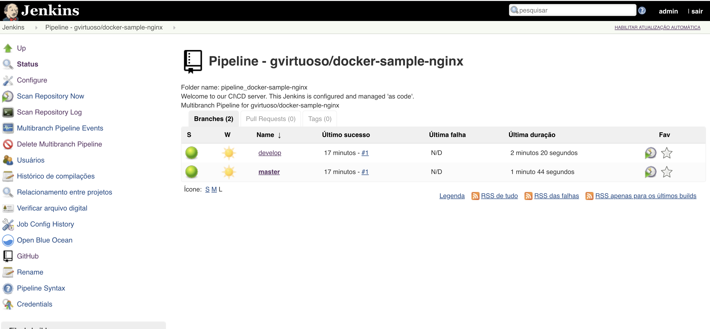

I also have installed the `BlueOcean` plugin for Jenkins that is a really nice interface for manage pipelimes:
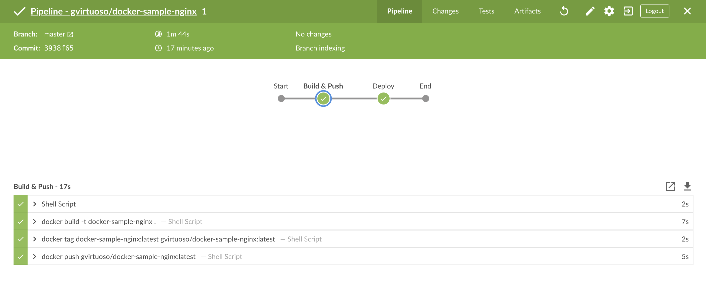

You can open the `BlueOcean` clicking on the left menu.

Images on DockerHub:
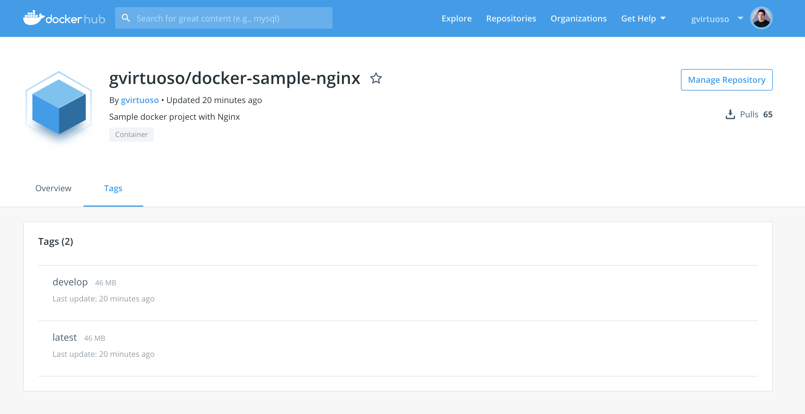

---
###### *Navigate* | [*Top*](#terraform-aws-k8s-jenkins-pipeline) | [*1) Requisites and Configurations*](#1-requisites-and-Configurations-before-start) | [*2) Infrastructure Creation*](#2-infrastructure-creation) | [*3) Jenkins Access and Use*](#3-jenkins-access-and-use) | [*4) Jenkins Crecdentials*](#4-creating-credentials-on-jenkins) | [*5) The Project*](#5-the-project) | [*6) Pipeline*](#6-pipeline) | [*7) Infrastructure exclusion*](#7-infrastructure-exclusion) | [*Conclusion*](#conclusion) | 
---

## 7) Infrastructure exclusion

You can delete all resources that we have created following the scripts below:
- `$ AWS_PROFILE=<profile_name> ./500.remove-k8s.sh`
- `$ AWS_PROFILE=<profile_name> ./501.remove-aws-infra.sh`

---
###### *Navigate* | [*Top*](#terraform-aws-k8s-jenkins-pipeline) | [*1) Requisites and Configurations*](#1-requisites-and-Configurations-before-start) | [*2) Infrastructure Creation*](#2-infrastructure-creation) | [*3) Jenkins Access and Use*](#3-jenkins-access-and-use) | [*4) Jenkins Crecdentials*](#4-creating-credentials-on-jenkins) | [*5) The Project*](#5-the-project) | [*6) Pipeline*](#6-pipeline) | [*7) Infrastructure exclusion*](#7-infrastructure-exclusion) | [*Conclusion*](#conclusion) | 
---

## Conclusion

Here you have a full project to provisioning a CI/CD infrastructure using Terraform, Kubernetes, Jenkins and AWS.
You can customize all vars also you can create new `Groovy Scripts` for your projects.

Feel free to open an Issue ticket with suggestions, questions and bugs =D

---
###### *Navigate* | [*Top*](#terraform-aws-k8s-jenkins-pipeline) | [*1) Requisites and Configurations*](#1-requisites-and-Configurations-before-start) | [*2) Infrastructure Creation*](#2-infrastructure-creation) | [*3) Jenkins Access and Use*](#3-jenkins-access-and-use) | [*4) Jenkins Crecdentials*](#4-creating-credentials-on-jenkins) | [*5) The Project*](#5-the-project) | [*6) Pipeline*](#6-pipeline) | [*7) Infrastructure exclusion*](#7-infrastructure-exclusion) | [*Conclusion*](#conclusion) | 
---
